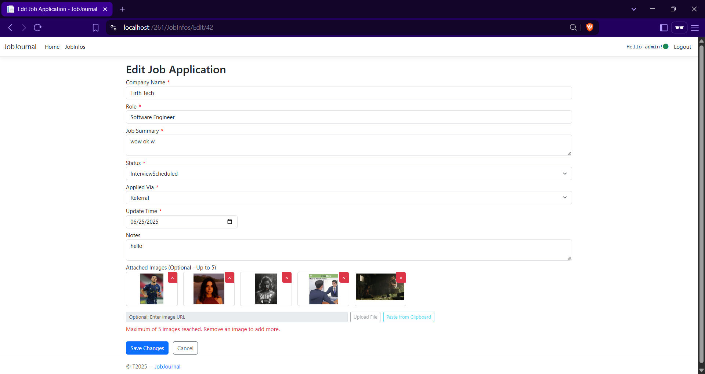
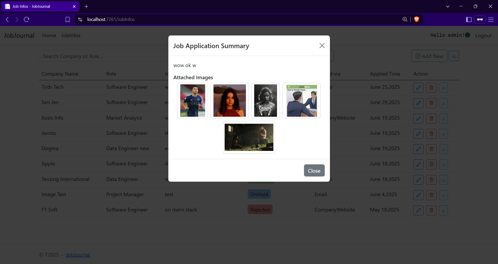

# JobJournal

**A Personal Job Application Tracking System**

JobJournal is a lightweight and intuitive web application designed to help users effectively track and manage their job applications. Built with **ASP.NET Core MVC**, it provides a centralized place to record application details, attach relevant documents or screenshots, and monitor the status of each application from submission to offer.

---

## 📸 Screenshots

### Home Page


### Job Info List


### Create New Application


### Edit Application


### Delete Application Confirmation


### Application Summary Modal


### Statistics View


---

## ✨ Features

### ✅ Job Application Management (CRUD)

* **Create**: Add new job applications with Company Name, Role, Job Summary, Status, Applied Via, Time, and Notes.
* **Read**: View all applications in an organized table. Expand summaries and notes for full details.
* **Update**: Modify any detail including status, notes, and images.
* **Delete**: Remove applications with confirmation and clean-up.

### 🖼️ Image Attachments

* Attach up to 5 images per application (e.g., job posts, offers, feedback).
* Images stored as **Base64** strings in the database.
* Preview thumbnails in summary modal.
* Full-screen viewer with previous/next navigation.

### 🔍 Filtering & Searching

* Search by **Company Name** or **Role**.
* Filter by **Status** (e.g., "Applied", "Interview Scheduled").
* Filters and search terms persist across reloads.

### 🔐 User Authentication

* Secure auth via **ASP.NET Core Identity**.
* Supports **Google OAuth** and local sign-in.

### 📧 Email Notifications

* Configured via **SendGrid** for account confirmation, password reset, etc.

### 🔔 Toast Notifications

* Feedback on successful or failed operations.

### 🖥️ User-Friendly Interface

* Responsive design using **Bootstrap 5.3**.
* Custom **404** error page.
* Scroll-to-top button for better UX.

---

## 🛠️ Technologies Used

* **Backend**: ASP.NET Core 8.0 (C#)
* **Database**: Entity Framework Core with SQLite
* **Frontend**:

  * Razor Pages
  * HTML, CSS, JavaScript
  * Bootstrap 5.3 + Bootstrap Icons
  * jQuery
* **Authentication**: ASP.NET Core Identity + Google OAuth
* **Email Service**: SendGrid (via MailKit/MimeKit)
* **Excel Export**: EPPlus
* **Image Serialization**: Newtonsoft.Json

---

## 🚀 Setup & Installation

### 📋 Prerequisites

* [.NET 8.0 SDK](https://dotnet.microsoft.com/en-us/download) or higher
* [Visual Studio 2022](https://visualstudio.microsoft.com/) or VS Code

### 📦 Steps

1. **Clone the repository**:

```
git clone https://github.com/tirthacodes/JobJournal.git
cd JobJournal
```

2. **Restore NuGet packages**:

* Open in Visual Studio. It should auto-restore.
* Or go to: `Tools > NuGet Package Manager > Manage NuGet Packages for Solution...` and click **Restore**.

3. **Manage Database Migrations**:

* Open **Package Manager Console**:

```
Add-Migration YourMigrationName -context AppDbContext
Update-Database -context AppDbContext
```

* This creates and updates `app.db` (SQLite).

4. **Configure `appsettings.json`**:

```json
{
  "Authentication": {
    "Google": {
      "ClientId": "YOUR_ACTUAL_GOOGLE_CLIENT_ID",
      "ClientSecret": "YOUR_ACTUAL_GOOGLE_CLIENT_SECRET"
    }
  },
  "SendGrid": {
    "ApiKey": "SG.YOUR_ACTUAL_SENDGRID_API_KEY_HERE",
    "SenderEmail": "your@verified.email.com",
    "SenderName": "JobJournal Support"
  }
}
```

* **Google OAuth**:

  * Create OAuth Client ID in [Google Cloud Console](https://console.cloud.google.com/).
  * Redirect URI: `https://localhost:PORT/signin-google`

* **SendGrid**:

  * Create account: [https://sendgrid.com/](https://sendgrid.com/)
  * Create API Key with Mail Send permission
  * Verify your sender email

5. **Run the application**:

* In Visual Studio: Press `F5`
* Or use CLI:

```
dotnet run
```

---

## 💡 Usage

* **Register/Login**: Create an account or use Google.
* **Add Job**: Click **Add New**, fill details, attach images.
* **View Jobs**: Listed on main **JobInfos** page.
* **Edit/Delete**: Use icons to edit or delete entries.
* **Details & Images**: Click "Show more" for full view + images.
* **Search/Filter**: Use top bar and dropdown to filter.

---

## 🤝 Contributing

1. Fork the repository
2. Create a new branch

```
git checkout -b feature/your-feature-name
```

3. Commit and push

```
git commit -m "Add feature"
git push origin feature/your-feature-name
```

4. Open a Pull Request

---

## 📄 License

Licensed under the [MIT License](https://github.com/tirthacodes/JobJournal/blob/main/LICENSE.txt)

---

## 📞 Contact

**Tirtha Bhattarai**
📬 LinkedIn: [tirthacodes](https://www.linkedin.com/in/tirthacodes)

---
